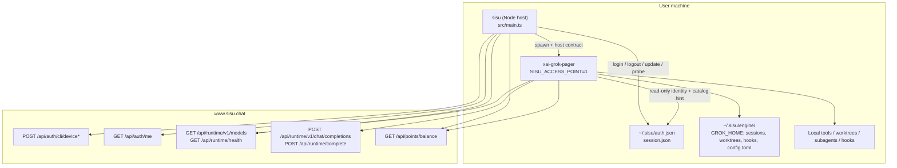
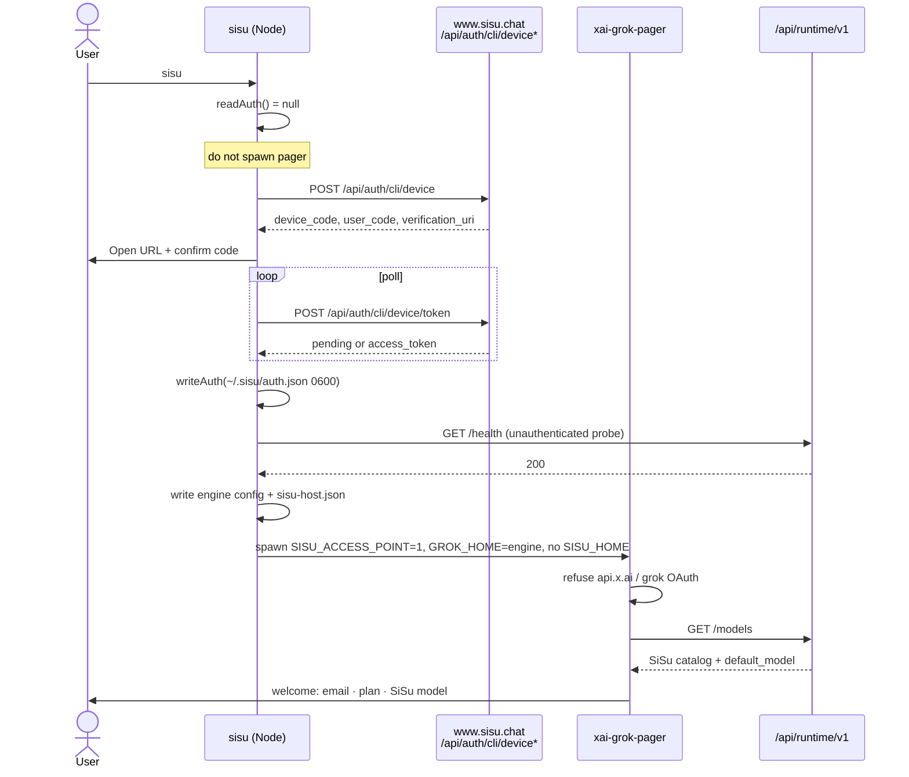
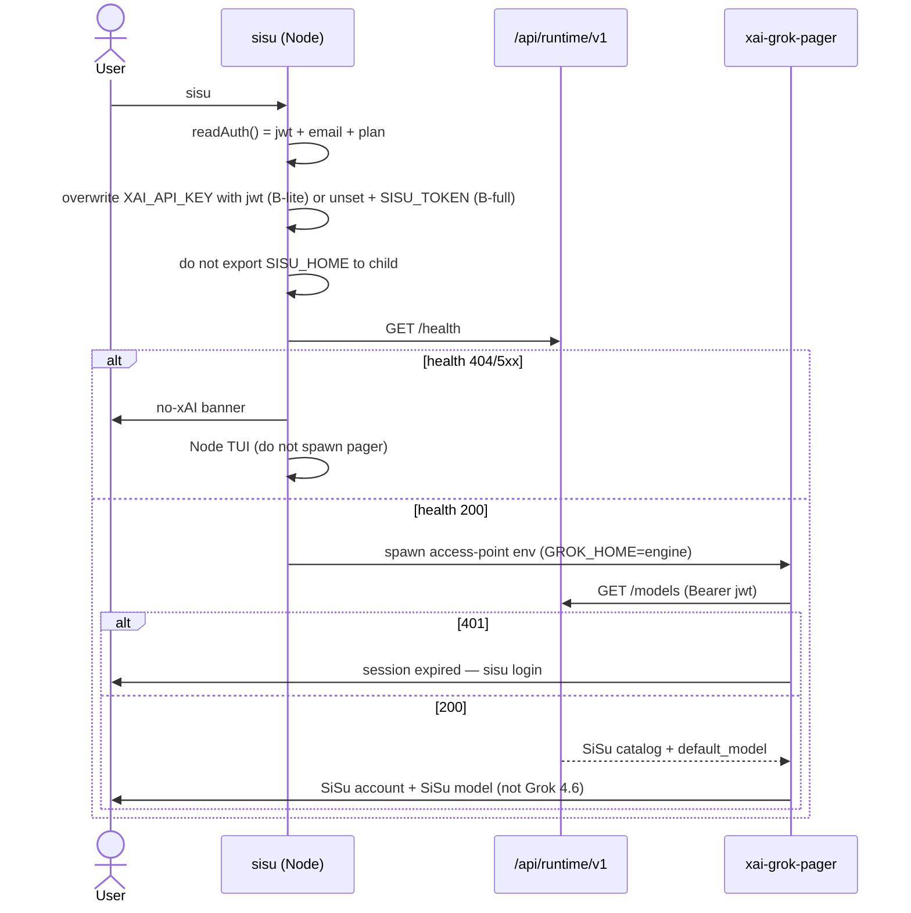
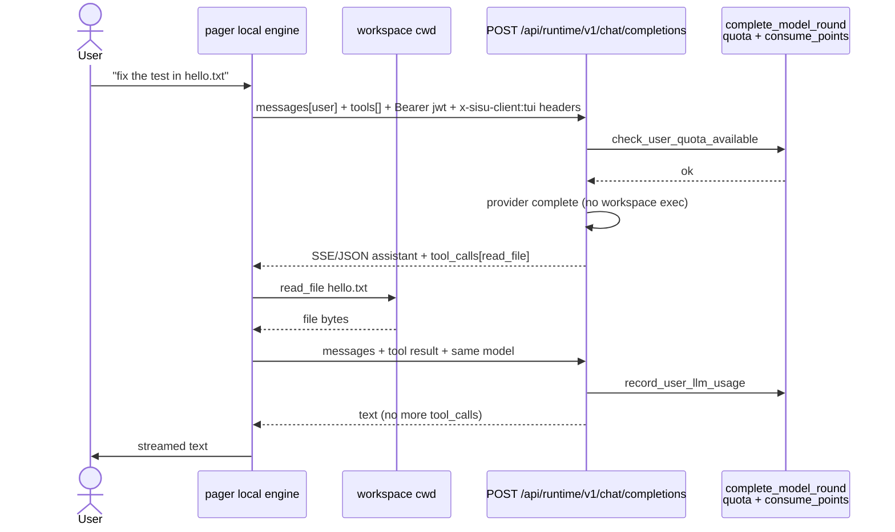

# SiSu Access Point: grok-build TUI as a real local runtime

| Field | Value |
| --- | --- |
| **Title** | Turning vendored grok-build into the SiSu access point |
| **Author** | SiSu engineering |
| **Date** | 2026-08-18 |
| **Status** | Draft |
| **Audience** | Senior engineers on `sisu-cli`, `wulabllm/backend`, and the vendored grok-build tree |
| **Repos** | `sisu-cli` (`/Users/steve/Desktop/SiSu-claude/sisu-cli`), FastAPI (`/Users/steve/Desktop/SiSu-claude/wulabllm/backend` + `wulabllm-deploy` copy), vendored grok-build (`sisu-cli/vendor/grok-build/`, gitignored; shipped as brotli GitHub Release asset) |

---

## Overview

SiSu CLI is a **local runtime** in the same product class as Claude Code, Grok Build, Codex, and OpenCode. The user-facing command is `sisu`. When a TTY is present and the vendored grok-build pager binary exists, that pager **is** the interactive session. Remote SiSu (`https://www.sisu.chat`) is the cloud those CLIs give their own products: device login, model catalog, quota/billing, and billed completions. Workspace tools stay on the machine.

Today the pager is a **skin plus a thin env remap**. After `npm i -g @stevezhou/sisu`, opening the TUI still shows Grok Build changelog, "Logged in with API key", and footer **Grok 4.6 (high)**. That is not an access point. This document designs the host/engine split that makes every cloud-facing plane — identity, catalog, inference, billing, chrome, update, deploy, install — talk only to SiSu, and fail closed if it cannot.

The recommended shape is **Approach B: SiSu host + grok-build engine**, shipped as **B-lite then B-full**. Node/`sisu` owns identity, login UX, model/quota display data, update, and fail-closed probe. The pager is the local agent. A small explicit **SiSu host contract** (`SISU_ACCESS_POINT=1` + env + `~/.sisu` layout) makes grok-build refuse grok.com / api.x.ai. B-lite keeps the JWT on the existing `XAI_API_KEY` sampler path while isolating homes, pinning catalog URLs, and gating OAuth / changelog / `grok-4.6` fallback. B-full introduces `SISU_TOKEN` only after the credential-seam table is live — never unset `XAI_API_KEY` before that, or the pager falls back to **Grok 4.6**. Approach A (env/config only) is the current rejected skin. Approach C (deep fork of `xai-grok-auth` / models / update / billing) is higher fidelity and much worse merge pain.

---

## Background & Motivation

### Product constraint

The product owner’s instruction is explicit: this cannot remain a skin. The pager must be SiSu’s access point the way Claude Code is Anthropic’s and Grok Build is xAI’s. First surfaces stay 思溯 / SiSu / 思有所溯 + Möbius. Apache-2.0 grok-build NOTICE/LICENSE remain. Internal crate names (`xai-grok-*`) are not renamed. Ollama/local-only models and convert-a lineage are out of scope.

### What is already real on the Node side

`sisu login` / `sisu exec` / the Node TUI fallback already implement the SiSu contract:

| Plane | Implementation |
| --- | --- |
| Identity | `~/.sisu/auth.json` (0700 home / 0600 file) via `src/store.ts` (`readAuth` / `writeAuth` / `clearAuth`). Shared with SiSu Desktop. |
| Login | RFC 8628 device-code + email/password + token in `src/commands.ts` (`webLoginCommand`, `loginCommand`). Endpoints: `POST /api/auth/cli/device`, `/token`, `/exchange`, `POST /api/auth/login`, `GET /api/auth/me`. |
| Catalog | `GET /api/chat/models` in `src/runtime/models.ts` (`fetchModelCatalog`, `resolveRuntimeModel`). Last choice in `~/.sisu/session.json` (`last_model`). |
| Inference | `POST /api/runtime/complete` SSE in `src/runtime/adapter.ts` (`createSisuCloudModel`). Refuses `task_category: coding` `/api/chat/send`. Stamps `client: tui\|cli`, `client_version`, `client_request_id`. |
| Local tools | `src/runtime/loop.ts` + `src/runtime/tools.ts`: `read_file`, `search_replace`, `grep`, `bash`. Cloud sees messages + tool defs + tool results only. |
| Quota | `GET /api/points/balance` via `fetchBalance` / `formatQuota`. |

Headless `sisu exec` / `sisu -p` already runs this loop (`src/main.ts` → `execCommand` → `execLocalTurn`).

### What the FastAPI runtime already is

Mounted at `/api` in both trees:

```281:281:wulabllm/backend/app/main.py
app.include_router(cli_runtime.router, prefix="/api")
```

(`wulabllm-deploy/backend/app/main.py` is the same include.)

`wulabllm/backend/app/routers/cli_runtime.py`:

| Route | Role |
| --- | --- |
| `POST /api/runtime/complete` | SSE `text` + `tool_call`. Auth: `get_current_user`. |
| `POST /api/runtime/v1/chat/completions` | OpenAI-compat for grok-build `ChatCompletions`. Same billed round. |
| `GET /api/runtime/v1/models` | OpenAI-shaped list + `api_backend: chat_completions` + `default_model` from `User.preferred_model`. |

`complete_model_round` (`app/services/cli_runtime.py`) forwards messages + tools to the provider, extracts text/tool_calls, bills via `record_user_llm_usage` / `consume_points`. `executes_workspace_tools()` is hard-`False`. The chat-send coding payload is rejected with 422.

Streaming paths are already allowlisted in `app/middleware.py`:

```python
STREAMING_PATHS = frozenset({"/api/chat/send", "/api/runtime/complete", "/api/runtime/v1/chat/completions"})
```

### What the pager actually is today (verified)

The TTY path is a trampoline. From `sisu-cli/src/tui.ts` `runTui`:

```263:272:sisu-cli/src/tui.ts
  if (usePager && !deps.pager) {
    const grokBin = findGrokBuildBinary()
    if (grokBin && process.stdout.isTTY) {
      writeSisuGrokConfig()
      io.close?.()
      const child = spawn(grokBin, [], { stdio: 'inherit', env: sisuGrokBuildEnv(), cwd: process.cwd() })
      return await new Promise((resolve) => {
        child.on('exit', (code) => resolve(code ?? 1))
        child.on('error', () => resolve(1))
      })
```

`sisuGrokBuildEnv` / `sisu_boot::apply()` (`vendor/grok-build/crates/codegen/xai-grok-pager-bin/src/sisu_boot.rs`, called first in `main.rs`) only remaps:

| Env / file | Value | Gap |
| --- | --- | --- |
| `GROK_HOME` | `SISU_HOME` / `~/.sisu` | Collides with SiSu `auth.json` format (see Identity). |
| `XAI_API_KEY` | `auth.json.token` **only if env unset** | User-shell `XAI_API_KEY` **wins**. JWT is treated as an xAI API key. |
| `GROK_XAI_API_BASE_URL` / `XAI_API_BASE_URL` | `{api_base}/api/runtime/v1` **only if `auth.json` has `api_base`** | Unauthenticated launch keeps `https://api.x.ai/v1`. |
| `GROK_TELEMETRY_ENABLED` | `0` if unset | Other xAI planes (changelog CDN, update, grok.com OAuth, SuperGrok) still live. |
| `~/.sisu/config.toml` | `[endpoints] xai_api_base_url = "{runtime}"` | Does **not** set `models_list_url` / `cli_chat_proxy_base_url`. |

Skin already landed: welcome badge `"SiSu  "` (`welcome/mod.rs` `render_version_badge`), Möbius (`welcome/mobius.rs` + `logo.rs`), help/version strings, npm 0.2.2 postinstall pager (`scripts/install-pager.js`, darwin-arm64 only).

### Why the 2026-08-18 screenshot still looks like Grok

The pager authenticated and listed models as an xAI/Grok client. Concrete mechanisms, all live in the current code:

1. **No token → no remap.** `sisu_boot` returns early if `~/.sisu/auth.json` is missing. `EndpointsConfig::default()` then uses `XAI_API_BASE_URL_DEFAULT = "https://api.x.ai/v1"` and `CLI_CHAT_PROXY_BASE_URL_DEFAULT = "https://cli-chat-proxy.grok.com/v1"` (`xai-grok-shell/src/agent/config.rs`).
2. **JWT stuffed into `XAI_API_KEY`.** `AuthStatus::resolve` (`cli_models.rs`) returns `ApiKey` whenever `has_xai_api_key_env()` is true — it does **not** consult `disable_api_key_auth`. Welcome paints **"Logged in with API key"** iff `is_api_key_auth` (`welcome/mod.rs` 481–483). Live TUI `is_api_key_auth` is *also* set from ACP session `meta.auth_mode` / `subscription_tier` matching `"apikey"` (`app_view.rs`) and from advertised auth methods (`event_loop.rs`). Unsetting the env var is not enough if `resolve_credentials` still classifies the bearer as `AuthType::ApiKey`.
3. **Catalog fetch miss → `first_or_fallback` → Grok 4.6.** Two different code paths, do not conflate:
   - `has_custom_endpoint()` is true only if `models_base_url` or `models_list_url` is set — **not** if `xai_api_base_url` is overridden. That only changes *where* the list is fetched.
   - `resolve_model_list` already skips merging baked `default_models.json` when `has_custom_endpoint()` is true (`config.rs` ~3490–3499).
   - The **user-visible** Grok 4.6 footer is `prefetch_models_blocking` returning `None` (404, empty list, missing key) then `resolve_default_model` `first_or_fallback()` calling `crate::models::default_model()` = **`grok-4.6`** (`default_models.json`, display **"Grok 4.6"**, `reasoning_effort: "high"`). Production `www.sisu.chat` `/api/runtime/*` live state is **unverified** from this workspace; treat 404 as a real risk until the PR 1 merge gate is green.
4. **Changelog is independent of the API base.** `ChangelogManager` fetches `https://x.ai/cli/changelogs` (`xai-grok-shell-base/src/util/changelog.rs`). `GROK_CHANGELOG_OFFLINE` already short-circuits fetch to disk cache — a previously fetched xAI changelog under `~/.sisu` would still render unless the cache is deleted.
5. **Shell `XAI_API_KEY` wins.** Both Node (`sisuGrokBuildEnv`) and Rust (`sisu_boot`) only write the env var when it is unset. A developer with an xAI key in `~/.zshrc` never uses `~/.sisu/auth.json.token`. `sisu_boot` also does not unset `GROK_CODE_XAI_API_KEY`.
6. **`SISU_HOME` beats `GROK_HOME`.** `xai-grok-home::resolve_grok_home` prefers a non-empty `SISU_HOME` over `GROK_HOME`. Setting both (`SISU_HOME=~/.sisu` and `GROK_HOME=~/.sisu/engine`) makes `grok_home()` **`~/.sisu`**, so engine `config.toml` / `sessions/` are ignored. `store_api_key` / `read_api_key` always use `$grok_home/auth.json` and **ignore `GROK_AUTH_PATH`**. Clobber is on the **write** path (`store_api_key`, `AuthManager::update`), not `AuthManager::new` (strict read → `Unreadable`, no rename).

This is the rejected skin.

---

## Goals & Non-Goals

### Goals

- Opening `sisu` on a TTY with the pager installed is a **SiSu session**: SiSu account (email / plan), SiSu catalog labels, SiSu preferred/default model, billed `POST /api/runtime/v1/chat/completions` (or `/complete`) with the SiSu JWT.
- `sisu login` (device code) is the only login. The pager never starts grok.com / auth.x.ai OAuth.
- `sisu logout` / in-TUI `/logout` clears `~/.sisu/auth.json` only. No grok credentials are created or required.
- Missing/404 `/api/runtime/*` on the configured API base is a **hard fail for the pager**. Never silent fallback to `api.x.ai` or baked-in Grok 4.6. Interactive `sisu` falls back to the Node TUI (still SiSu-billed via `/api/runtime/complete` / `/api/chat/models`); it does not `exit 1`.
- User-shell `XAI_API_KEY` does **not** win over `~/.sisu/auth.json` in access-point mode.
- Workspace tools, worktrees, subagents, hooks stay on disk. Cloud contract is messages + tool defs + tool results.
- First-session chrome that still says Grok (changelog, SuperGrok, `grok update`, "Logged in with API key", `Usage: grok`) is remapped or suppressed.
- Apache-2.0 NOTICE/LICENSE remain. npm command stays `sisu`. Identity stays in `~/.sisu`, shared with Desktop.

### Non-Goals

- Renaming internal crates (`xai-grok-auth`, `xai-grok-models`, `xai-grok-update`, …) or ACP method names (`x.ai/models/list`).
- Moving workspace tools to the server, or using `/api/chat/send` with `task_category: coding`.
- Ollama / local-only models (future).
- Convert-a lineage.
- Making the Node pager (`src/pager/*`) the primary interactive UI when the Rust binary exists.
- Full visual restyle of every grok-build modal, ACP string, or doctor diagnostic in the first increment.
- Replacing grok-build’s local tool implementations with the smaller Node set.

---

## Key Decisions

| # | Decision | Rationale |
| --- | --- | --- |
| K1 | **Approach B: SiSu host + grok-build engine.** Reject A. Defer C. | A is the current skin and cannot stop grok OAuth, changelog CDN, SuperGrok, `default_models.json`, or `XAI_API_KEY` winning. C rewrites `xai-grok-auth` / models / update / billing inside Rust and will not merge with upstream. B puts product planes in Node (already real) and adds a small, testable access-point gate in the pager. |
| K2 | **Explicit host contract, not more env luck.** Flag `SISU_ACCESS_POINT=1`. | A boolean the pager can refuse to ignore. Today’s remap is optional and incomplete (`GROK_XAI_API_BASE_URL` only). |
| K3 | **Split identity home from engine home — and do not set `SISU_HOME` on the pager child.** Host computes `engine = $SISU_HOME/engine` but exports only `GROK_HOME=engine`, `GROK_AUTH_PATH=$engine/auth.json`, `SISU_AUTH_PATH=$SISU_HOME/auth.json`. The child **must not** inherit `SISU_HOME`. Defense-in-depth: change `xai-grok-home::resolve_grok_home` so a non-empty `GROK_HOME` wins if both are set, and route `store_api_key` / `read_api_key` / `clear_api_key` through `GROK_AUTH_PATH` (never SiSu `auth.json`). | `resolve_grok_home` prefers `SISU_HOME` over `GROK_HOME`. Setting both keeps `grok_home() == ~/.sisu`. `store_api_key` ignores `GROK_AUTH_PATH` and writes `$grok_home/auth.json`. Write-path recovery (`read_auth_json_or_empty_recovering_corrupt`) can rename SiSu identity to `auth.json.corrupt.*`. `AuthManager::new` only marks the file `Unreadable` — launch alone does not clobber; ACP `xai.api_key` authenticate does. |
| K4 | **JWT is a session credential. `SISU_TOKEN` is B-full; do not unset `XAI_API_KEY` until the seam table is implemented.** B-lite (PR 2a + PR 3): host **overwrites** `XAI_API_KEY` with `auth.json.token` (shell key discarded), keeps inference working. B-full (PR 2b, same npm as the access-point pager): unset `XAI_API_KEY` / `GROK_CODE_XAI_API_KEY`, set `SISU_TOKEN`, teach the seam table. `GROK_DISABLE_API_KEY_AUTH` is defense-in-depth only — it does not change `AuthStatus::resolve` and leaves non-xAI base URLs as BYOK. Force `is_api_key_auth = false` and non-ApiKey session meta in the pager. | grok-build has **no** `SISU_TOKEN` reader. `fetch_models_blocking` and `resolve_credentials` last-resort `read_xai_api_key_env()`. Unset the env before the seam and prefetch is `None` → `first_or_fallback` → **Grok 4.6**. Routing `SISU_TOKEN` through `read_xai_api_key_env()` would restore the badge. |
| K5 | **Pin every cloud URL. Empty proxy is not a disable.** Set `GROK_CLI_CHAT_PROXY_BASE_URL` to the **same SiSu runtime base** as models (never blank). Skip `fetch_settings_blocking`, grok.com skills, feedback, and managed-config sync when `sisu_access_point::active()`. Optionally add `GROK_DISABLE_CLI_CHAT_PROXY=1` so `proxy_url()` does not fall back to `CLI_CHAT_PROXY_BASE_URL_DEFAULT`. | `EndpointsConfig::proxy_url()` treats blank as unset and returns `https://cli-chat-proxy.grok.com/v1`. Settings, feedback, and AuthManager `proxy_base_url` all go through this. |
| K6 | **Hard fail the *pager* on missing runtime; fall back to Node TUI.** Host probes unauthenticated `GET /api/runtime/health` before spawn. 404/5xx → print the no-xAI banner and run the Node TUI (SiSu `/complete`), **do not `exit 1`**, **do not spawn the pager**. Pager in access-point mode still refuses `api.x.ai` and baked `grok-4.6`. Do not publish the host npm that unsets `XAI_API_KEY` until PR 3’s seam is in the stamped binary. | Access point is useless if prod 404s and the pager becomes Grok. Node TUI / `sisu exec` already speak `/api/runtime/complete` and (until PR 5) `/api/chat/models` — a models-v1 404 does not imply those are dead. |
| K7 | **Pager is the only interactive path when the binary exists.** Node loop remains `sisu exec` / `-p` and the TTY fallback when the binary is missing or `SISU_TUI_STATIC=1`. | Matches product: "when the grok-build pager binary exists, that is the interactive session." Do not run two interactive agents. |
| K8 | **Cloud wire stays OpenAI-compat ChatCompletions for the pager; Node keeps `/complete`.** Both already exist and share `complete_model_round`. | grok-build sampler speaks ChatCompletions. Rewriting the sampler is Approach C. Stamp `client` / `client_version` / `client_request_id` on the OpenAI path too. |
| K9 | **Default model = `session.json last_model` if still in catalog, else catalog `default_model` (user preferred), else first row.** Same order as Node `resolveRuntimeModel` (`models.ts` 55–59). `/model` merge-writes `~/.sisu/session.json`. **Do not set `GROK_DEFAULT_MODEL`.** In access-point mode `first_or_fallback` errors instead of calling `crate::models::default_model()`. | `resolve_default_model` priority is CLI > `GROK_DEFAULT_MODEL` env > config > remote `default_model`. Injecting last_model via that env beats preferred_model and a stale `grok-4.6` leftover from 0.2.2 becomes an explicit pref. Empty-catalog miss still hits bundled grok-4.6 unless `first_or_fallback` is gated. |
| K10 | **Update is npm + GitHub Release, never x.ai.** Disable `xai-grok-update` auto-update and `Command::Update` in access-point mode. Add `sisu update` on the host. | `auto_update.rs` prints `curl -fsSL https://x.ai/cli/install.sh` and `npm i -g @xai-official/grok`. |
| K11 | **Do not rename crates.** First-and-session surfaces must say SiSu; internals may still say grok. | Merge cost vs. user-visible proof. Honest about leftover strings (see "What B cannot do"). |
| K12 | **Quota 402/403 map to SiSu copy + `https://www.sisu.chat` top-up.** Never SuperGrok. Backend 402 *before* inference using the **same** `check_user_quota_available` path as chat (`pipeline_phases.py` already `raise HTTPException(402, detail=quota_msg)`). Keep the human `detail` (e.g. `余额不足，请充值`). Add machine `code: "quota_exhausted"`; do not rename web `detail`. Pager already treats every 402 as a credit block (`is_credit_limit_error`). | SuperGrok URLs live in `dispatch/billing.rs`. `complete_model_round` bills after the provider and does not pre-check. |
| K13 | **Host is the only authenticator. Direct pager invoke without `SISU_ACCESS_POINT=1` exits 2.** Unauthenticated `sisu` never spawns the pager. In-TUI `/login` / welcome `l` print “exit and run `sisu login`” or exit **10** so the host runs `webLoginCommand` and respawns. No spawn-of-`sisu-login` from inside the alt screen, no in-process Rust device-code in v1. `SISU_GROK_BIN` dev goes through `sisu` so the host sets the contract. No self-apply from `~/.sisu/auth.json`. | Self-apply is how today’s skin leaked. Spawn-from-TUI is unspecified (TTY already `stdio: inherit`). Finding SiSu `auth.json` without `SISU_HOME` on the child needs `SISU_AUTH_PATH`, which logout uses. |

---

## Proposed Design

### Architecture



Node is the **host**. The pager is the **engine**. The host never asks the engine to invent identity. The engine never talks to grok.com / auth.x.ai / api.x.ai / x.ai/cli when `SISU_ACCESS_POINT=1`.

### Host contract (normative)

Set by `sisuGrokBuildEnv()` in `sisu-cli/src/runtime/launch.ts`. The pager (`sisu_boot::apply` + a new `sisu_access_point` module) asserts the same values and **exits 2** if they are missing or still point at xAI defaults.

**Pager child must not inherit `SISU_HOME`.** The host process keeps `SISU_HOME` for `store.ts`. The child sees `GROK_HOME` only. `xai-grok-home` today prefers `SISU_HOME`; exporting both undoes the engine split.

Two phases of the same contract (see K4). Fields marked *B-full only* must not ship in an npm that still launches a 0.2.2 / B-lite pager.

```
# Always (B-lite and B-full)
SISU_ACCESS_POINT=1
# SISU_HOME is intentionally UNSET in the child
GROK_HOME=<abs $SISU_HOME/engine>          # only GROK_HOME; host computed this path
GROK_AUTH_PATH=$GROK_HOME/auth.json        # never the SiSu identity file
SISU_AUTH_PATH=<abs $SISU_HOME/auth.json>  # logout / badge read; host-owned format
SISU_ACCOUNT_EMAIL=ada@sisu.chat
SISU_ACCOUNT_PLAN=<plan_code>
SISU_API_BASE=https://www.sisu.chat
GROK_XAI_API_BASE_URL=$SISU_API_BASE/api/runtime/v1
XAI_API_BASE_URL=$SISU_API_BASE/api/runtime/v1
GROK_MODELS_BASE_URL=$SISU_API_BASE/api/runtime/v1
GROK_MODELS_LIST_URL=$SISU_API_BASE/api/runtime/v1/models
GROK_CLI_CHAT_PROXY_BASE_URL=$SISU_API_BASE/api/runtime/v1   # NOT empty — empty → grok.com
GROK_DISABLE_CLI_CHAT_PROXY=1              # skip settings / skills / feedback / managed-config
GROK_TELEMETRY_ENABLED=0
GROK_CHANGELOG_OFFLINE=1
GROK_DISABLE_API_KEY_AUTH=1                # advertise-kill only; not the badge fix
# Do NOT set GROK_DEFAULT_MODEL

# B-lite (PR 2a + old or new pager): keep sampler working
XAI_API_KEY=<auth.json.token>              # OVERWRITE shell; do not inherit
# SISU_TOKEN unset

# B-full (PR 2b, same npm as access-point pager with seam table)
SISU_TOKEN=<auth.json.token>
# XAI_API_KEY and GROK_CODE_XAI_API_KEY UNSET (delete, do not inherit)
# unless SISU_ALLOW_XAI=1 (undocumented debug)
```

`writeSisuGrokConfig()` writes `$GROK_HOME/config.toml` (engine home), not `$SISU_HOME/config.toml`. Host also deletes any cached `CHANGELOG.*` under both `~/.sisu` and `engine/` on first access-point launch so `GROK_CHANGELOG_OFFLINE` cannot replay xAI notes.

```toml
# sisu-managed grok-build config — SiSu access point. Do not point at xAI.
[endpoints]
xai_api_base_url = "https://www.sisu.chat/api/runtime/v1"
models_base_url = "https://www.sisu.chat/api/runtime/v1"
models_list_url = "https://www.sisu.chat/api/runtime/v1/models"
cli_chat_proxy_base_url = "https://www.sisu.chat/api/runtime/v1"

[grok_com_config]
disable_api_key_auth = true

[cli]
auto_update = false

[features]
telemetry = false
feedback = false
```

Optional host-written hint file `$SISU_HOME/engine/sisu-host.json` (0600) so the pager does not have to re-parse SiSu `auth.json`:

```json
{
  "access_point": true,
  "email": "ada@sisu.chat",
  "plan_code": "pro",
  "name": "Ada",
  "api_base": "https://www.sisu.chat",
  "default_model": "kimi-k2.5",
  "last_model": "kimi-k2.5",
  "quota_url": "https://www.sisu.chat",
  "client": "tui",
  "client_version": "0.2.2"
}
```

### Credential seam (B-full; required before unsetting `XAI_API_KEY`)

`SISU_TOKEN` is unknown to grok-build today. These sites must learn it **without** making `has_xai_api_key_env()` true:

| Site | File / function | Must do |
| --- | --- | --- |
| Env-key predicate | `auth_method::{read,has}_xai_api_key_env` | Stay **false** when only `SISU_TOKEN` is set. Do not read `SISU_TOKEN` here. |
| Catalog fetch | `remote/client.rs` `fetch_models_blocking` ApiKey/custom branch | `Authorization: Bearer $SISU_TOKEN` when access-point. Error text must not say “Set XAI_API_KEY.” |
| Inference creds | `agent/config.rs` `resolve_credentials` | If `SISU_TOKEN` set: use it as bearer, `AuthType::SessionToken` (not `ApiKey`), base URL = SiSu runtime. Before the `read_xai_api_key_env()` last resort. |
| Advertise | `should_advertise_xai_api_key` / ACP `xai.api_key` | Not advertised. |
| Probe | `should_probe_first_party_env_key` / `GET {xai_api_base_url}/api-key` | Skip. |
| Persist | `storage.rs` `store_api_key` / `read_api_key` / `clear_api_key` | Use `GROK_AUTH_PATH` if set; never `$SISU_AUTH_PATH`. Unreachable from ACP in access-point mode. |
| Badge | Welcome `is_api_key_auth` + session `auth_mode` | Forced false; badge from `SISU_ACCOUNT_*`. |
| Boot | `sisu_boot::apply` | If `SISU_ACCESS_POINT=1`, **never** write `XAI_API_KEY` from `auth.json`. Unset `GROK_CODE_XAI_API_KEY`. |

B-lite does **not** implement this table. It keeps `XAI_API_KEY=<jwt>` (overwriting the shell) and still gates advertise / probe / badge / `first_or_fallback`.

### Plane 1 — Identity / session

**Today**

- Pager login: `Command::Login` → `xai_grok_shell::auth::run_cli_login` (OAuth via auth.x.ai / grok.com, `--oauth`, `--device-auth`). Welcome Pending menu: `"Login with grok.com"` (`welcome/mod.rs` `login_label.unwrap_or("grok.com")`).
- `/login` → `dispatch_login` → `Effect::Authenticate` against advertised ACP methods (`xai.api_key`, grok.com).
- `/logout` → `Effect::Logout` → shell `send_logout` clears grok `AuthStore`.
- Token injection: `XAI_API_KEY := auth.json.token` (only if env unset).
- `GROK_HOME=~/.sisu` plus `SISU_HOME=~/.sisu` means `grok_home()` is still `~/.sisu`. `AuthManager::new` will **not** rename a SiSu-shaped file (strict read → `Unreadable`). `store_api_key` / `AuthManager::update` **will** recover-as-corrupt and write a grok `AuthStore` over Desktop-shared identity.

**Need**

1. **Host is the only authenticator.** `sisu login` remains RFC 8628 + email/password/token. Pager never calls `run_cli_login`.
2. **Cold start, no `~/.sisu/auth.json`:** Node `runTui` does **not** spawn the pager. It runs `webLoginCommand` (print URL + code, open browser), writes `auth.json`, then (if runtime health is ok) spawns. Same as “sign in first” for Claude Code / Grok when unauthenticated — except the IdP is SiSu.
3. **In-TUI `/login` / welcome `l`:** print “exit and run `sisu login`”, or quit the pager with a well-known exit code (e.g. `10`) that the host loops on to run `webLoginCommand` then respawn. **Do not** spawn `sisu login` as a child of the full-screen TUI (`stdio: inherit` already consumed; alt-screen restore is unspecified). No in-process Rust device-code in v1.
4. **Welcome badge:** `email` + `plan_code` from host hint / `SISU_ACCOUNT_*`. Never "Logged in with API key". Force **both** paths false: env-key (`has_xai_api_key_env` / `AuthStatus::ApiKey`) **and** session-meta (`auth_mode` / `subscription_tier` `"apikey"`). `GROK_DISABLE_API_KEY_AUTH` does not do this.
5. **Logout:** host `clearAuth()` (`src/store.ts`). Pager `/logout` and pager `Command::Logout` unlink `$SISU_AUTH_PATH` (SiSu file) and the host hint; they do **not** write grok `AuthStore` and do **not** consult `SISU_HOME` (it is unset on the child). Node `sisu logout` already does this.
6. **401 / expired JWT:** map existing `detail` `"Invalid or expired token"` / `"User not found"` (`deps.py` `get_current_user`) to “session expired — run `sisu login`”. Do not rename the web `detail`. Optional later: add a machine `code` without changing `detail`.

**Pager stubs (access-point mode)**

| grok-build entry | Access-point behavior |
| --- | --- |
| `Command::Login` | Print “use `sisu login`” and exit 2. |
| `Command::Logout` | Unlink `$SISU_AUTH_PATH` (+ host hint). Do not touch `$GROK_HOME/auth.json` as a grok store. |
| `dispatch_login` | Message or exit-10; never `Effect::Authenticate` / grok OAuth. |
| `dispatch_logout` | Clear SiSu auth via `SISU_AUTH_PATH`, return to Pending with SiSu copy. |
| `run_cli_login` / OIDC / auth.x.ai | Unreachable (`debug_assert` / early return). |
| `xai.api_key` ACP method | Not advertised. `store_api_key` unreachable. |
| `should_probe_first_party_env_key` / `GET {xai_api_base_url}/api-key` | Skipped. |
| `is_api_key_auth` + session `auth_mode` | Forced false / non-ApiKey. Badge from `SISU_ACCOUNT_*`. |
| Direct binary, `SISU_ACCESS_POINT` missing | Print “run `sisu`” and exit 2. No self-apply. |

### Plane 2 — Model catalog

**Today**

- Fetch: `fetch_models_blocking` → `GET {source.url}` (`remote/client.rs`).
- URL: custom (`models_list_url` / `{models_base_url}/models`) **else** `{xai_api_base_url}/models` for ApiKey **else** `{cli-chat-proxy}/models` for Session.
- Parse: `parse_remote_model_value` requires `model`/`id` and a non-zero `context_window` (defaults to 256k). Accepts `api_backend: chat_completions`.
- Miss / empty / error → `None` → `resolve_default_model` `first_or_fallback()` → `crate::models::default_model()` = **`grok-4.6`**. (Separate from the `resolve_model_list` merge, which already skips baked defaults when `has_custom_endpoint()`.)
- Node catalog is a different endpoint: `GET /api/chat/models` (`models[]` + `display_name`). Engine is `GET /api/runtime/v1/models` (OpenAI `data[]` + `name` / `default_model`).

**Need**

1. Always set `GROK_MODELS_LIST_URL` so `has_custom_endpoint()` is true and the list URL is SiSu, not the proxy.
2. Backend `openai_models_list` **already** emits grok-build-parseable rows (`id`, `model`, `name` from `display_name`, `context_window`, `api_backend: chat_completions`, `owned_by: sisu`, `default_model`). Keep that shape. Do not “add” `owned_by`. `supports_reasoning_effort` is absent and grok-build defaults it **false** (`remote/client.rs` ~926–931), so SiSu rows will not get a `(high)` suffix unless someone copies grok-4.6 metadata — leave it false.
3. **Required:** switch host `fetchModelCatalog` to `GET /api/runtime/v1/models` (PR 5, not optional). Keep `/api/chat/models` for the web app only. One source so `sisu models` and the TUI footer cannot drift.
4. Default selection order (pager + Node). Implemented by reading `sisu-host.json` / `session.json` and catalog `default_model` — **not** via `GROK_DEFAULT_MODEL`:
   1. Explicit `/model` or `--model` / `-m`
   2. `~/.sisu/session.json` `last_model` if still in catalog
   3. `default_model` from the catalog (user `preferred_model`)
   4. First catalog row
   5. **Never** `default_models.json` when `SISU_ACCESS_POINT=1` — `first_or_fallback` errors with “no SiSu model available”
5. `/model` in the pager merge-writes `$SISU_AUTH_PATH`’s sibling `session.json` (`dirname(SISU_AUTH_PATH)/session.json`), same JSON shape as `store.ts`. Host `setModelCommand` already does this.
6. Footer / prompt `model_name` is the SiSu `name` (already `display_name` from `openai_models_list`).

### Plane 3 — Inference / billing

**Today**

- Pager sampler posts ChatCompletions to `endpoints.xai_api_base_url` (`agent/mvp_agent/agent_ops.rs`).
- Backend alias exists: `POST /api/runtime/v1/chat/completions` → `complete_model_round`.
- 402 handling in pager: `is_credit_limit_error` (`dispatch/billing.rs`) → SuperGrok modal / `https://grok.com/supergrok?referrer=grok-build`.
- `complete_model_round` records usage after the provider returns. It does **not** pre-check `check_user_quota_available` (chat pipeline phase 3 does, 402). Empty wallet can still start a provider call.

**Need**

1. Every pager turn: `POST {api_base}/api/runtime/v1/chat/completions` with `Authorization: Bearer <B-lite: XAI_API_KEY = JWT | B-full: SISU_TOKEN>`, plus client stamps (below). Tools stay in the OpenAI `tools` array. Follow-up rounds send `role: tool` messages. Server never executes tools.
2. **Client stamps — pager must write them; backend accept is not enough.** grok-build `ChatCompletionRequest` will not grow Node’s JSON keys unless we add them. Do not rely on unknown body fields (likely dropped).
   - **Write site (pager) — two bags, because they have different lifetimes:**
     - **Once per model prepare:** `xai_grok_shell::agent::config::sampling_config_for_model` (~5169) copies `info.extra_headers` onto `SamplerConfig`. `GrokApiClient` applies `extra_headers` at **client construction** (`sampler/src/client.rs` ~608–614), rebuilt on model switch (`prepare_sampling_config_for_model`), not on every `post`. Put only stable stamps here:
       - `x-sisu-client: tui`
       - `x-sisu-client-version: <sisu-host.json client_version / npm>`
     - **Once per POST:** set `SamplerConfig::header_injector` (documented “Per-request header injector … Called in `post()`”, `xai-grok-sampler/src/config.rs` 134–136; invoked at `client.rs` 782–784). The injector adds a **fresh** `x-sisu-client-request-id: <uuid>` on every ChatCompletions `post()`. Do **not** put the request id in `extra_headers` — that yields one id per sampler rebuild and billed `client_request_id` collides across turns.
   - **Read site (backend):** `openai_chat_completions` in `cli_runtime.py` copies those headers into `payload["client"]` / `client_version` / `client_request_id` when the body omits them. `normalize_complete_request` already persists them on `record_user_llm_usage` metadata (`runtime: local`).
   - Test: recorded ChatCompletions requests **per turn** (two consecutive completes in one session) include the three headers and **distinct** `x-sisu-client-request-id` values. Backend test that they land in metadata is necessary but not sufficient.
3. Pre-flight quota: the router calls the **same** `check_user_quota_available` as `pipeline_phases.py` and raises `HTTPException(402, detail=quota_msg)` **before** `call_poe_api_raw`. Keep the existing Chinese/English `detail` (`余额不足，请充值` / monthly-reset copy). Add JSON `code: "quota_exhausted"` without renaming `detail`. Pager `is_credit_limit_error` already treats every 402 as a credit block.
4. Pager access-point 402/403 copy:

   > SiSu quota exhausted. Top up at https://www.sisu.chat

   `UPSELL_URL_UPGRADE` / `UPSELL_URL_PAYG` become `https://www.sisu.chat`. `open_supergrok_upsell` / `Action::OpenSupergrokUrl` open that URL or a no-op + message. No `grok.com/supergrok`.
5. 401 → “session expired — `sisu login`”. 403 disabled account → SiSu copy, not ZDR/SuperGrok.
6. Latency target: first token comparable to web chat on the same model (provider-bound). Local tool round-trip is disk + one more complete. Node loop already caps 8 tool rounds (`DEFAULT_MAX_ROUNDS`); keep grok-build’s own cap for the pager.

### Plane 4 — Local runtime

Keep grok-build’s local surface on disk, under **engine home** `~/.sisu/engine/`:

- Tools (`xai-grok-tools`: read/edit/search/shell plus grok-build extras)
- Worktrees (`xai-fast-worktree`)
- Subagents, hooks, MCP credentials, plugins, skills
- Session transcripts (`GROK_HOME/sessions`)

Do **not** move these to the server. Do **not** send `task_category: coding`.

**Interactive vs headless**

| Entry | Implementation |
| --- | --- |
| `sisu` (TTY, pager binary present) | Spawn pager (access-point). |
| `sisu` (TTY, pager missing) | Node TUI (`runPager` / line TUI). Print once: “install pager for the full local agent (`sisu update` / postinstall)”. |
| `sisu` (`SISU_TUI_STATIC=1` or non-TTY) | Node line TUI / no spawn. |
| `sisu exec` / `sisu -p` | Node `execCommand` → `runLocalTurn` (smaller tool set). Do **not** silently route through `launchGrokBuildHeadless` unless we later add a flag. |
| Pager `Command::Agent` / `-p` if user invokes the binary directly | Allowed only with the same host contract; still SiSu-billed. |

Node loop remains the **headless and fallback** path. It is not a second interactive product.

### Plane 5 — Product chrome

| Surface | Today | Access-point (must) | Won’t touch (this program) |
| --- | --- | --- | --- |
| Welcome logo / Möbius / 「思有所溯」 | Skin done | Keep | — |
| Version badge "SiSu  {VERSION}" | Skin done | Keep; VERSION may still be grok-build 1.0.x — show `sisu {npm}` from host hint if cheap | crate `xai-grok-version` |
| "Logged in with API key" | Live | SiSu email · plan | — |
| "Login with grok.com" | Live | "Login with SiSu" / handoff | — |
| Changelog welcome + `/release-notes` | `https://x.ai/cli/changelogs` | **Empty slot (decided).** `GROK_CHANGELOG_OFFLINE=1` + delete cached `CHANGELOG.*` under old `~/.sisu` and `engine/` on first access-point launch. No xAI notes. No GitHub Release notes in v1. | changelog.rs CDN constant |
| SuperGrok upsells, `/voice` paywall, credit modal | `dispatch/billing.rs` | SiSu quota URL | Telemetry event type names |
| `grok update` / auto-update | `x.ai/cli/install.sh`, `@xai-official/grok` | Disabled; `sisu update` | crate name `xai-grok-update` |
| Binary `--version` / clap `Usage: grok` | `grok 1.0.5` | If user ran `sisu`, they never see this. If they run `~/.sisu/bin/xai-grok-pager` directly, print SiSu access-point banner + “use `sisu`”. Full clap rename is C. | clap bin name |
| `Command::Doctor` / Login / Logout / Setup | Grok copy, `~/.grok` | Doctor: SiSu home, runtime URL, token present. Setup: disabled or “use `sisu login`”. | Most diagnostics |
| Feedback “How can we improve Grok Build?” | grok-build | Hide (`features.feedback = false`) | — |
| Help `~/.grok` | grok-build | Host help already says `~/.sisu` (`src/main.ts` `helpText`) | In-binary `--help` long_about |
| Trust prompt | Already says “SiSu may run or modify…” | Keep | — |

### Plane 6 — Deploy

The access point is useless if production 404s.

**Fact:** routers exist in **both** `wulabllm/backend/app/main.py:281` and `wulabllm-deploy/backend/app/main.py:282`. `STREAMING_PATHS` already includes the two runtime POST paths. `backend-contract.sh` is generic `/api/health` only. Whether `www.sisu.chat` has actually deployed `/api/runtime/*` is **unverified** from this workspace — implementers must not treat “may not have shipped” as optional folklore.

**Merge gate (PR 1; required before any host npm that probes prod)**

Unauthenticated, no canary secret:

```bash
# must be 200 JSON { "ok": true, "models": true, "complete": true }
curl -fsS https://www.sisu.chat/api/runtime/health
# must be 401 (not 404) — proves the route exists and requires get_current_user
curl -sS -o /dev/null -w '%{http_code}' https://www.sisu.chat/api/runtime/v1/models
```

Add `GET /api/runtime/health` in PR 1 (no auth). Host `assertRuntimeAvailable` calls **this** URL, not `/models`.

Authenticated catalog smoke is optional and uses deploy-CI secret `SISU_RUNTIME_CANARY_TOKEN` (a dedicated canary user JWT minted once via existing `POST /api/auth/login` / `sisu login --token`, stored in the deploy environment). If the secret is absent, skip the 200-models check; the 401-on-`/models` gate is enough to prevent “route missing”.

**Also in PR 1**

- `POST /api/runtime/complete` with `task_category: coding` + `message` → 422 (already unit-tested).
- Quota pre-check on both complete paths: same `check_user_quota_available` + `HTTP 402` `detail=quota_msg` as chat; plus `code: "quota_exhausted"`.
- Host/engine: if health 404/5xx, **do not spawn the pager**. Print:

  > SiSu runtime is not available at {api_base}/api/runtime. This CLI will not fall back to xAI. Using the Node TUI.

  Then run Node TUI. Do not `exit 1`.

- Pager second line of defense: if resolved `xai_api_base_url` contains `api.x.ai` or `grok.com` while `SISU_ACCESS_POINT=1`, exit 2.

### Plane 7 — Install / update

**Today**

- `npm i -g @stevezhou/sisu@0.2.2` → `postinstall.js` → `installPager()`.
- Supported: **`darwin-arm64` only** (`scripts/install-pager.js` `SUPPORTED`).
- Asset: `https://github.com/hyzhou1990/sisu-cli/releases/download/v{version}/xai-grok-pager-{key}.br`.
- Dest: `~/.sisu/bin/xai-grok-pager` + `{dest}.version` stamp. Skip if stamp matches package version.
- Other platforms: Node TUI. Missing binary is not an error (`postinstall` never fails npm).

**Need**

1. Remaining platforms (ordered): `darwin-x64`, `linux-x64`, `linux-arm64`, then `win32-x64`. Same brotli + stamp scheme. CI matrix builds `xai-grok-pager` with `sisu_boot` + access-point gate, uploads `.br`.
2. `sisu update`: re-run `installPager({ force: true })` against the current (or latest npm) version. Never call `xai-grok-update`.
3. Install **never** leaves a grok.com-authed binary as the default:
   - Host always sets the contract on spawn.
   - Binary `sisu_boot` in access-point mode refuses xAI defaults even if someone runs it from `~/.sisu/bin` without Node (print “run `sisu`”).
   - Do not ship a `grok` symlink.
4. Version-stamped upgrade already exists; keep it. Bump stamp when access-point pager lands so 0.2.2 skins are replaced.

### Sequence diagrams

#### Cold start — no `~/.sisu/auth.json`



#### Start — valid `~/.sisu` token



#### One tool-using turn



---

## API / Interface Changes

### Host (`sisu-cli`)

`sisuGrokBuildEnv()` becomes the contract builder. Sketch (B-lite shown; B-full deletes `XAI_API_KEY` and sets `SISU_TOKEN` instead — **same npm as the access-point pager**, never before):

```ts
export function sisuGrokBuildEnv(): NodeJS.ProcessEnv {
  const auth = readAuth()
  const home = getSisuHome()
  const engine = path.join(home, 'engine')
  const apiBase = auth?.api_base || process.env.SISU_API_BASE || DEFAULT_API_BASE
  const runtime = `${apiBase.replace(/\/+$/, '')}/api/runtime/v1`
  const env = { ...process.env }
  delete env.SISU_HOME // child must not see this — grok_home() would ignore GROK_HOME
  delete env.GROK_CODE_XAI_API_KEY
  delete env.GROK_DEFAULT_MODEL
  // B-lite: overwrite shell key. B-full: delete env.XAI_API_KEY instead.
  env.XAI_API_KEY = auth?.token || ''
  return {
    ...env,
    SISU_ACCESS_POINT: '1',
    GROK_HOME: engine,
    GROK_AUTH_PATH: path.join(engine, 'auth.json'),
    SISU_AUTH_PATH: path.join(home, 'auth.json'),
    SISU_ACCOUNT_EMAIL: auth?.email || '',
    SISU_ACCOUNT_PLAN: auth?.plan_code || '',
    SISU_API_BASE: apiBase,
    GROK_XAI_API_BASE_URL: runtime,
    XAI_API_BASE_URL: runtime,
    GROK_MODELS_BASE_URL: runtime,
    GROK_MODELS_LIST_URL: `${runtime}/models`,
    GROK_CLI_CHAT_PROXY_BASE_URL: runtime,
    GROK_DISABLE_CLI_CHAT_PROXY: '1',
    GROK_TELEMETRY_ENABLED: '0',
    GROK_CHANGELOG_OFFLINE: '1',
    GROK_DISABLE_API_KEY_AUTH: '1',
  }
}
```

New host functions (names indicative):

- `assertRuntimeAvailable(http)` — `GET {api_base}/api/runtime/health` (no token). Throws typed `RuntimeUnavailable` on 404/5xx. Does **not** use `/models` as the deploy/liveness probe.
- `writeSisuHostHint()` — `engine/sisu-host.json`.
- `purgeChangelogCache(home, engine)` — delete `CHANGELOG.*` under both.
- `installPager` already exists; add `sisu update` in `src/main.ts` (PR 7).

`runTui`: if no auth → `webLoginCommand` then continue; if health probe fails → print no-xAI banner and **run Node TUI** (do not spawn, do not exit 1); never spawn without `SISU_ACCESS_POINT`; never export `SISU_HOME` to the child.

### Pager (minimal Rust, no crate rename)

New module next to `sisu_boot.rs`, e.g. `sisu_access_point.rs`, called immediately after `sisu_boot::apply()`:

```rust
pub fn enforce() {
    if std::env::var_os("SISU_ACCESS_POINT").as_deref() != Some(std::ffi::OsStr::new("1")) {
        eprintln!("run `sisu` — this binary is the SiSu local engine, not a grok.com client");
        std::process::exit(2);
    }
    // Assert GROK_XAI_API_BASE_URL contains "/api/runtime/v1"
    // Assert it does not contain "api.x.ai" / "grok.com"
    // Assert SISU_HOME is unset (or GROK_HOME wins — see xai-grok-home patch)
    // Assert GROK_MODELS_LIST_URL is set
    // Unset GROK_CODE_XAI_API_KEY
    // B-full only: unset XAI_API_KEY unless SISU_ALLOW_XAI=1
    // Never write XAI_API_KEY from ~/.sisu/auth.json (sisu_boot must stop doing that)
}
```

Gated behavior (`sisu_access_point::active()`):

- `ChangelogManager::fetch` honors `GROK_CHANGELOG_OFFLINE` (contract sets it); cache already purged by host.
- `auto_update` / `Command::Update` → message to `sisu update`.
- `run_cli_login` → refuse.
- `resolve_default_model` `first_or_fallback` → error, no `default_models.json`.
- `is_api_key_auth` + session `auth_mode` → false / non-ApiKey; badge from `SISU_ACCOUNT_*`.
- `UPSELL_URL_*` → `https://www.sisu.chat`.
- `fetch_settings_blocking` / grok.com skills / feedback / managed-config → skip (`GROK_DISABLE_CLI_CHAT_PROXY=1`).
- `proxy_url()` must not return `cli-chat-proxy.grok.com` (pinned URL + disable flag).
- B-full Bearer: `SISU_TOKEN` via the credential-seam table, never `read_xai_api_key_env()`.

### Backend

| Change | Where |
| --- | --- |
| Quota pre-check → 402, `detail=quota_msg` from `check_user_quota_available`, plus `code: "quota_exhausted"` | `cli_runtime.py` `complete` + `openai_chat_completions`. Same helper as `pipeline_phases.py`. Do **not** invent a second human `detail`. |
| Read `x-sisu-client*` headers into `client*` when body omits them | `openai_chat_completions`; then existing `normalize_complete_request` |
| **Required** `GET /api/runtime/health` | unauthenticated `{ "ok": true, "complete": true, "models": true }`. Host probe + PR 1 merge gate. |
| 401 `detail` stays `"Invalid or expired token"` / `"User not found"` | `deps.py` `get_current_user`. Pager maps the English strings. Do not rename for web clients. |
| Models list | already has `default_model`, `display_name`→`name`, `owned_by: sisu` |

No new server-side tools. No `/api/chat/send` coding.

---

## Data Model Changes

### `~/.sisu` layout (host-owned)

```
~/.sisu/                    mode 0700
  auth.json                 0600  { token, email, user_id, api_base, plan_code, name }
  session.json              0600  { last_model, last_conversation_id, last_project_id }
  workspace-paths.json      0600  existing
  last-copy.txt             existing Node TUI
  bin/xai-grok-pager        0755  + .version stamp
  engine/                   0700  GROK_HOME — grok-build scratch
    config.toml             0600  sisu-managed endpoints
    sisu-host.json          0600  display hint
    auth.json               empty unused grok AuthStore (GROK_AUTH_PATH). store_api_key must target this file, never ../auth.json
    sessions/ worktrees/ hooks/ …
```

Pager child env has `GROK_HOME=engine` and **no** `SISU_HOME`. Identity writes go to `SISU_AUTH_PATH`. Engine writes go to `GROK_HOME`.

**Migration:** current 0.2.2 users have `GROK_HOME=~/.sisu` (and often `SISU_HOME=~/.sisu`), so grok-build may have written `sessions/`, `config.toml`. `AuthManager::new` will not have renamed `auth.json`; a prior `/login` or `store_api_key` might have. On first access-point launch:

1. If `~/.sisu/auth.json` parses as SiSu (`typeof token === 'string'`), keep it.
2. If it parses as neither SiSu nor empty, do **not** overwrite; print a warning and write a copy to `engine/auth.json.bak`.
3. Move grok-build scratch dirs (`sessions`, `worktrees`, `hooks`, …) into `engine/` if present at the top level, leaving `auth.json` / `session.json` / `bin/` in place.
4. Rewrite `config.toml` only if it is missing or contains the `sisu-managed` marker (today’s `writeSisuGrokConfig` already uses that guard).

No server schema migration. Billing source string stays `cli_runtime`.

---

## Alternatives Considered

### A. Env/config adapter only (current)

Keep grok-build unmodified except strings + `sisu_boot` env remap.

| Pros | Cons |
| --- | --- |
| Minimal merge. Already shipped in 0.2.2. | User already rejected this. Cannot stop grok OAuth, changelog CDN, SuperGrok, `default_models.json`, `XAI_API_KEY` win, `auth.json` format collision, or `cli-chat-proxy.grok.com`. Screenshot is the acceptance test and it fails. |

**Rejected.**

### B. SiSu host + grok-build engine (recommended)

Node owns product planes. Pager is the local engine under an explicit contract. Small Rust gates; no crate renames.

| Pros | Cons |
| --- | --- |
| Reuses real Node identity/login/catalog/billing. Incremental PRs. Upstream grok-build merges stay mostly mechanical. Fail-closed is implementable at the host *and* the binary. | Some in-binary strings and clap `Usage: grok` remain if the binary is invoked directly. ACP method names stay `x.ai/*`. Changelog/update need gates, not just env. Engine/identity home split is a migration. |

**Chosen.** Shipped as B-lite then B-full (K4).

### B-lite (sequenced inner increment of B — not a third product)

Keep the JWT in `XAI_API_KEY` so `fetch_models_blocking` / `resolve_credentials` / the sampler work with **zero** new credential readers. Still:

- isolate homes (K3: no `SISU_HOME` on the child);
- pin `GROK_MODELS_LIST_URL` + `GROK_CLI_CHAT_PROXY_BASE_URL` to SiSu runtime;
- overwrite (do not inherit) ambient `XAI_API_KEY`;
- gate grok OAuth, `GROK_CHANGELOG_OFFLINE=1` + cache purge, auto-update, `first_or_fallback`;
- skip `GET /api-key` probe and do not advertise `xai.api_key`;
- **force** `is_api_key_auth = false` and non-ApiKey session meta (badge override).

This is what PR 2a + PR 3 ship first. It actually fixes the screenshot (catalog + no grok OAuth + no Grok 4.6 + no xAI changelog) without inventing `SISU_TOKEN`.

**Not sufficient as the end state:** JWT still sits in `XAI_API_KEY`, so any ungated `AuthStatus::resolve` / session-meta path paints “Logged in with API key” again, and `store_api_key` remains a write-path footgun. B-full (PR 2b + seam table) is required to stop calling the token an API key. Cheaper than a new env var are the advertise/probe/badge gates — those land in B-lite. The new env var is only justified once those gates exist and we still want `has_xai_api_key_env() == false`.

### C. Deep fork

Rewrite `xai-grok-auth`, `xai-grok-models`, `xai-grok-update`, billing dispatch, clap bin name, welcome auth, changelog CDN inside Rust.

| Pros | Cons |
| --- | --- |
| Highest user-visible fidelity. Direct binary invoke looks 100% SiSu. | Multi-crate conflict with every grok-build pull. AuthStore vs SiSu JWT still needs a design. Duplicates Node login. Weeks of merge tax for strings. Violates “do not rename every internal crate” in spirit even if crates keep names but lose behavior. |

**Deferred.** Revisit only for leftover chrome after B is true on the shipped path (`sisu` → account + models + billed turn).

### What B cannot do (honest)

- Crate names, rustc paths, ACP `x.ai/models/list`, Mixpanel event type names (`SuperGrokUpsellShown`).
- `xai-grok-pager` binary filename and clap default `Usage: grok` when the binary is invoked by path.
- Every doctor / wrap / plugin help string that mentions `~/.grok` or “Grok”.
- grok-build’s baked `default_models.json` still exists for non-access-point builds; we must not load it when the flag is on.
- Pixel-identical replacement of every SuperGrok modal illustration — we remap URL + copy, not redesign the widget tree in PR 1.

---

## Security & Privacy Considerations

| Threat | Severity | Mitigation |
| --- | --- | --- |
| grok-build write path corrupts `~/.sisu/auth.json` (Desktop-shared) | **High** | Child has no `SISU_HOME`; `GROK_HOME=engine`; `store_api_key` / `read_api_key` / `clear_api_key` honor `GROK_AUTH_PATH`. Host never writes grok `AuthStore` into SiSu `auth.json`. Tests must exercise the **write** path (simulate ACP `xai.api_key` authenticate / `store_api_key`), not only two `sisuGrokBuildEnv()` calls. Launch-only can pass while a later authenticate still clobbers. |
| Ambient `XAI_API_KEY` sent to SiSu or used against api.x.ai | **High** | B-lite: host **overwrites** with SiSu JWT (shell discarded). B-full: unset `XAI_API_KEY` / `GROK_CODE_XAI_API_KEY`; JWT is `SISU_TOKEN` only. |
| Silent fallback to api.x.ai (data + billing leak to xAI) | **High** | Probe + pager refuse default hosts. No `default_models.json` fallback. |
| JWT in process env (`SISU_TOKEN`) | Medium | Same class as today’s `XAI_API_KEY` remap. 0600 files. Do not log env. `GROK_TELEMETRY_ENABLED=0`. |
| Telemetry / Mixpanel / OTLP to xAI | Medium | Keep telemetry off. Access-point mode skips `fetch_settings` against `cli-chat-proxy.grok.com`. |
| Changelog / update / feedback phone-home | Medium | `GROK_CHANGELOG_OFFLINE=1` + delete cached `CHANGELOG.*` under old and new homes; disable auto-update and feedback. |
| Device-code login CSRF / open-redirect | Low (existing) | Keep `resolveVerificationUrl` host rewrite to `SISU_API_BASE`. |
| Workspace tools as RCE | Accepted (local agent) | Trust prompt already SiSu-branded. Do not add server-side tools. |
| Quota bypass if billing is post-hoc | Medium | Add pre-check 402. |

Auth files stay 0600, home 0700 (`store.ts` `HOME_MODE` / `FILE_MODE`). Engine dir created 0700.

---

## Observability

| Signal | Where | Notes |
| --- | --- | --- |
| Host spawn log (stderr, debug) | `SISU_DEBUG=1` | Binary path, api_base, probe status. Never token. |
| `record_user_llm_usage` metadata | backend | `source=cli_runtime`, `client=tui\|cli`, `client_version`, `client_request_id`, `runtime=local`. |
| Probe failure | host stdout | Health 404/5xx: no-xAI banner then Node TUI. Metric (if we add one): `sisu.runtime.probe` {ok,404,5xx}. |
| Pager access-point refuse | pager stderr | Exit 2 + reason (`xai_default_url`, `missing_token`, `models_empty`). |
| Billing 402 | existing budget logs | Same as web chat once pre-check is shared. |
| Alert | deploy | Production synthetic: models 200 every 5m. Page if 404 (access point is dead). |

Do not enable grok-build Mixpanel / OTLP.

---

## Rollout Plan

1. **Backend first (prod).** `/api/runtime/health` 200 and `/api/runtime/v1/models` 401 (not 404) on `www.sisu.chat`. **Do not publish host npm (PR 2a) until this gate is green.**
2. **PR 2a (safe with old pager):** engine isolation without exporting `SISU_HOME`; pin models + proxy URLs; overwrite `XAI_API_KEY` with JWT (do **not** unset); no-auth → `webLoginCommand` first; health fail → Node TUI, never spawn, never `exit 1`.
3. **PR 3 + PR 2b same npm:** access-point pager (gates + seam). Stamp mismatch → reinstall / refuse spawn of a 0.2.2 skin. Only now unset `XAI_API_KEY` and set `SISU_TOKEN`.
4. **Chrome PRs** (badge if not already forced in PR 3, SuperGrok remap, `sisu update`).
5. **Platform binaries** after darwin-arm64 is proven.

**Node-TUI-on-probe-fail (single policy):** health 404/5xx → print the no-xAI banner → Node TUI. Pager is never spawned. Interactive `sisu` does not `exit 1`. `sisu exec` unchanged.

**Feature flags**

- `SISU_ACCESS_POINT=1` always set by host after PR 2a. No user-facing flag to turn the skin back on. Direct binary without it exits 2.
- `SISU_ALLOW_XAI=1` debug only; undocumented in `--help`.
- `SISU_TUI_STATIC=1` existing: force Node TUI.
- `SISU_GROK_BIN` existing: override binary path (dev).

**Rollback**

- npm previous: `npm i -g @stevezhou/sisu@<prev>`. Stamp mismatch re-downloads that version’s `.br`.
- Backend: router is additive; rollback is the previous deploy. Old CLIs using `/complete` keep working.

---

## Failure modes

| Failure | Current (skin) | Access-point |
| --- | --- | --- |
| Prod missing `/api/runtime/*` | 404 → baked Grok 4.6 / api.x.ai | Health probe fails; no spawn; no-xAI banner; **Node TUI**. |
| Expired JWT | 401 → grok re-auth / “API key” | Map `detail` “Invalid or expired token”; “session expired — `sisu login`”; do not open grok.com. |
| 402 quota | SuperGrok upsell | SiSu quota copy + `https://www.sisu.chat`. Backend 402 `detail=quota_msg` + `code: quota_exhausted` before provider. |
| Pager binary missing | Node TUI (ok) | Same; one-line hint to `sisu update`. Not a Grok session. |
| **`XAI_API_KEY` already set in the shell** | **Wins over `~/.sisu` token** (`sisuGrokBuildEnv`, `sisu_boot`) | B-lite: host **overwrites** with SiSu JWT. B-full: unsets; token is `SISU_TOKEN`. `sisu_boot` must not re-inject when `SISU_ACCESS_POINT=1`. |
| `store_api_key` on `$grok_home/auth.json` | Write-path `auth.json.corrupt.*` | No `SISU_HOME` on child; `GROK_HOME=engine`; `store_api_key` uses `GROK_AUTH_PATH`. |
| Empty catalog | Grok 4.6 via `first_or_fallback` | Access-point `first_or_fallback` errors: “no SiSu model available”. |
| Direct `~/.sisu/bin/xai-grok-pager` | Full Grok client | No `SISU_ACCESS_POINT` → print “run `sisu`” and **exit 2**. No self-apply. |
| Network down | grok errors / retry | Same, SiSu-branded; no xAI retry host. |

---

## Test strategy

Principle: **shipped-path tests**, not reimplemented logic. What must be true on `sisu` launch **twice**.

### Host (Jest, existing style in `launch.test.ts` / `identity.test.ts`)

1. `sisuGrokBuildEnv` with a fake host `SISU_HOME` (host process only):
   - `SISU_ACCESS_POINT=1`
   - child env has **no** `SISU_HOME`
   - `GROK_HOME` ends with `/engine`
   - `GROK_AUTH_PATH` is `$GROK_HOME/auth.json`, not the SiSu identity file
   - `SISU_AUTH_PATH` is the SiSu identity file
   - `GROK_MODELS_LIST_URL` is `{api}/api/runtime/v1/models`
   - `GROK_CLI_CHAT_PROXY_BASE_URL` is the same runtime base (not empty, not grok.com)
   - `GROK_CHANGELOG_OFFLINE=1`
   - **no** `GROK_DEFAULT_MODEL`
   - B-lite: `XAI_API_KEY` equals `auth.json.token` even if the shell had a different key
   - B-full (same test file, flag): `XAI_API_KEY` absent, `SISU_TOKEN` equals `auth.json.token`
2. Repeat after a second `sisuGrokBuildEnv()` (idempotent; SiSu `auth.json` still SiSu-shaped).
3. Write-path: calling a stub of `store_api_key` under the child env must not touch `SISU_AUTH_PATH`.
4. `writeSisuGrokConfig` / host hint: no `api.x.ai`, no `grok.com`.
5. `runTui` with `findGrokBuildBinary` stub + mock http: no auth → does not spawn, starts web login (mock).
6. Health 404 → does not spawn, Node TUI path, stderr has “will not fall back to xAI”, process does **not** require exit 1.
7. Existing `sisu exec --stub` twice (`launch.test.ts`) stays green (headless Node loop).

### Backend (`test_cli_runtime.py`)

Already: reject coding send; SSE + OpenAI tool_calls; `api_backend: chat_completions`. Add:

- 402 when quota check fails (inject `check_user_quota_available`); `detail` is that helper’s message; `code == "quota_exhausted"`.
- OpenAI path copies `x-sisu-client*` headers into billing metadata.
- `GET /api/runtime/health` is unauthenticated 200.
- `openai_models_list` already has `default_model` + display `name` (keep those assertions).

### Pager (Rust, access-point unit tests only — do not run the full grok-build suite in npm CI)

- `sisu_access_point::enforce` exits 2 if `SISU_ACCESS_POINT` missing or URL is `https://api.x.ai/v1`.
- Empty catalog + flag → `first_or_fallback` errors; **no** `grok-4.6`.
- `GROK_HOME=engine` + `SISU_HOME=~/.sisu` (if leaked) → `grok_home() == engine` after the home patch.
- `store_api_key` cannot write `SISU_AUTH_PATH`.
- Welcome badge uses `SISU_ACCOUNT_EMAIL`, not “Logged in with API key” (PR 3/4).
- Changelog: `GROK_CHANGELOG_OFFLINE` + missing cache → empty.

### Manual / release twice-launch (split by PR)

On a clean machine (or temp host `SISU_HOME`), **twice**:

**PR 3 merge-blocking:** `sisu login` → `sisu` → SiSu catalog (not Grok 4.6), billed turn against `/api/runtime/v1/chat/completions`, no request to `api.x.ai` / `grok.com`. Shell `XAI_API_KEY=xai-...` does not change the catalog.

**PR 4 merge-blocking:** welcome shows **email/plan**, never “Logged in with API key”. `/login` does not open grok.com. `sisu logout` deletes `~/.sisu/auth.json`; next `sisu` is SiSu device login.

**PR 7 merge-blocking:** welcome changelog empty (no xAI release notes); `sisu update` exists.

**PR 9** encodes the union of the PRs it depends on (2a/2b/3/4/5/6) — not PR 7 chrome. One turn that reads a file → billed row `source=cli_runtime` and `client=tui` (from `x-sisu-client` header).

npm pack CI cannot run the Rust binary in all jobs (vendor is gitignored). Host tests must assert the contract **and** the source of `sisu_boot.rs` / access-point module when the vendor tree is present (`identity.test.ts` pattern).

---

## Risks

| Risk | Severity | Mitigation |
| --- | --- | --- |
| Production `/api/runtime/*` not actually deployed; host hard-fail bricks TUI | High | PR 1 merge gate is unauthenticated health 200 + models 401. Probe fail → Node TUI, never spawn pager, never `exit 1`. |
| `auth.json` collision already happened on 0.2.2 installs | High | Migration: detect SiSu vs grok store; backup; never clobber a parseable SiSu token. |
| grok-build still hits `cli-chat-proxy` for settings / skills / managed config | Medium | Pin `GROK_CLI_CHAT_PROXY_BASE_URL` to SiSu runtime (empty still resolves to grok.com) **and** skip those fetches when `GROK_DISABLE_CLI_CHAT_PROXY=1`. |
| OpenAI-compat stream shape vs grok-build parser | Medium | Backend already emits ChatCompletions chunks; add a fixture test with a recorded grok-build parse if we can unit-test `parse_remote_model_value` shape. |
| JWT-as-Bearer rejected by grok-build extra headers (`X-XAI-Token-Auth`) | Medium | Custom-endpoint + ApiKey path sends only `Authorization: Bearer` (`fetch_models_blocking`). Keep that path (`has_custom_endpoint` true). Inference should be the same. |
| Merge pain on next grok-build vendor bump | Medium | Keep access-point gates in `sisu_boot.rs` + one module + a few `if sisu_access_point::active()` sites. Avoid rewriting auth manager. |
| Users with real xAI keys expect BYOK | Low | Out of scope. `SISU_ALLOW_XAI=1` is debug, not product. |
| darwin-only pager | Low | Node fallback remains; platform PRs follow. |
| Quota pre-check race (pass then consume fails) | Low | Same as web chat; consume is authoritative. |

---

## Open Questions

1. ~~In-TUI login spawn vs Rust device-code~~ **Decided (K13):** host is the only authenticator. In-TUI `/login` prints “exit and run `sisu login`” or exits 10 for the host to loop. No child spawn, no Rust device-code in v1.
2. ~~CLI catalog endpoint~~ **Decided:** host switches to `GET /api/runtime/v1/models` in PR 5 (required). `/api/chat/models` stays web-only.
3. ~~Show remaining quota on the welcome bar?~~ **Decided:** later chrome PR, **not** in the first increment (PRs 1–3) and **not** PR 4. Do not add `GET /api/points/balance` to PR 1 or PR 4. Node `formatQuota` / pager credit bar stay as they are until that later PR.
4. ~~Direct binary invoke~~ **Decided (K13):** missing `SISU_ACCESS_POINT` → print “run `sisu`” and exit 2. No self-apply. `SISU_GROK_BIN` goes through `sisu`.
5. ~~SiSu changelog source~~ **Decided:** welcome slot is **empty**. `GROK_CHANGELOG_OFFLINE=1` + purge cached `CHANGELOG.*`. No xAI notes. No GitHub Release notes in v1.

---

## References

- Host trampoline: `sisu-cli/src/tui.ts` (`runTui`), `sisu-cli/src/runtime/launch.ts` (`sisuGrokBuildEnv`, `writeSisuGrokConfig`, `findGrokBuildBinary`)
- Host identity: `sisu-cli/src/store.ts`, `sisu-cli/src/commands.ts`
- Host inference: `sisu-cli/src/runtime/adapter.ts`, `loop.ts`, `models.ts`, `tools.ts`, `transport.ts`
- Boot: `sisu-cli/vendor/grok-build/crates/codegen/xai-grok-pager-bin/src/sisu_boot.rs`, `main.rs` (`sisu_boot::apply()`)
- Welcome / badge: `.../xai-grok-pager/src/views/welcome/mod.rs`
- Endpoints / defaults: `.../xai-grok-shell/src/agent/config.rs` (`XAI_API_BASE_URL_DEFAULT`, `has_custom_endpoint`, `resolve_models_list_url`)
- Models fetch / fallback: `.../xai-grok-shell/src/remote/client.rs`, `.../agent/models/fetch.rs`, `.../agent/models/resolution.rs`, `.../xai-grok-models/default_models.json`
- Auth: `.../xai-grok-shell/src/auth/manager.rs`, `model.rs` (`AuthStore`), `storage.rs`, `agent/auth_method.rs` (`XAI_API_KEY`)
- Billing chrome: `.../xai-grok-pager/src/app/dispatch/billing.rs`
- Update: `.../xai-grok-update/src/auto_update.rs`
- Changelog: `.../xai-grok-shell-base/src/util/changelog.rs` (`https://x.ai/cli/changelogs`)
- Home: `.../xai-grok-home/src/lib.rs` (**today** prefers `SISU_HOME` over `GROK_HOME`; access-point must stop exporting `SISU_HOME` to the child and make `GROK_HOME` win if both leak)
- Changelog offline: `.../xai-grok-shell-base/src/util/changelog.rs` `GROK_CHANGELOG_OFFLINE`
- Credential last resort: `.../xai-grok-shell/src/agent/config.rs` `resolve_credentials` / `enforce_disable_api_key_auth`
- Sampler headers: `.../xai-grok-shell/src/agent/config.rs` `sampling_config_for_model` (`extra_headers`); `.../xai-grok-sampler/src/config.rs` `header_injector`; `.../xai-grok-sampler/src/client.rs` `post()` ~782
- Backend: `wulabllm/backend/app/routers/cli_runtime.py`, `services/cli_runtime.py`, `deps.py` (`get_current_user`), `services/llm_usage_billing.py`, `services/budget.py` (`check_user_quota_available`)
- Install: `sisu-cli/scripts/install-pager.js`, `package.json` 0.2.2
- Attribution: `sisu-cli/NOTICE`, `vendor/grok-build/LICENSE`, `NOTICE`

---

## PR Plan

Realistic incremental strategy. First PRs make **open `sisu` → SiSu account + SiSu models + SiSu billed turn** true. Chrome polish later. Each PR is independently reviewable and mergeable.

### PR 1 — Deploy `/api/runtime/*` to production and lock the contract

- **PR title:** `runtime: ship /api/runtime on www.sisu.chat and fail CI if health 404`
- **Files/components:** `wulabllm/backend` + `wulabllm-deploy` copy (`routers/cli_runtime.py`, `services/cli_runtime.py`, `middleware.py`, `main.py`); `wulabllm/scripts/runtime/backend-contract.sh`; `wulabllm/backend/tests/unit/test_cli_runtime.py`, `test_deploy_preflight.py`
- **Dependencies:** none
- **Description:** Confirm both trees include the router. Add **unauthenticated** `GET /api/runtime/health`. Merge gate: prod health 200 **and** `GET /api/runtime/v1/models` returns **401 not 404**. Optional canary `SISU_RUNTIME_CANARY_TOKEN` for authenticated models 200. Quota pre-check on both complete paths using `check_user_quota_available` (same 402 `detail` as chat) plus `code: "quota_exhausted"`. Header-to-`client*` copy on the OpenAI alias. Reject coding `/complete`. Do not start PR 2a npm publish until the gate is green.

### PR 2a — Host contract safe with the 0.2.2 pager (B-lite)

- **PR title:** `cli: isolate engine home, pin runtime URLs, probe health, keep JWT in XAI_API_KEY`
- **Files/components:** `sisu-cli/src/runtime/launch.ts`, `launch.test.ts`, `identity.test.ts`, `tui.ts`, `tui.test.ts`, `store.ts` (engine + `SISU_AUTH_PATH` helpers)
- **Dependencies:** PR 1 merge gate green on prod
- **Description:** `sisuGrokBuildEnv` B-lite: **do not export `SISU_HOME`**; `GROK_HOME=engine`; pin models + **non-empty** proxy URL to `/api/runtime/v1`; `GROK_CHANGELOG_OFFLINE=1`; overwrite `XAI_API_KEY` with `auth.json.token` (shell discarded); **do not unset** `XAI_API_KEY`; **do not set** `SISU_TOKEN` or `GROK_DEFAULT_MODEL`. `runTui`: no auth → `webLoginCommand` first; health fail → no-xAI banner + **Node TUI** (do not spawn, do not exit 1). Migrate top-level grok scratch into `engine/`; purge `CHANGELOG.*`. Tests: child env has no `SISU_HOME`; SiSu `auth.json` survives two env builds; write-path stub cannot touch it.

### PR 2b — Host B-full (same npm as PR 3)

- **PR title:** `cli: SISU_TOKEN + unset XAI_API_KEY once access-point pager is stamped`
- **Files/components:** `sisu-cli/src/runtime/launch.ts` (B-full branch); `launch.test.ts`; refuse spawn if pager stamp &lt; this version
- **Dependencies:** PR 2a; **must ship in the same npm as PR 3**
- **Description:** Unset `XAI_API_KEY` / `GROK_CODE_XAI_API_KEY`; set `SISU_TOKEN`. Stamp mismatch → reinstall / refuse spawn of a 0.2.2 binary (old `sisu_boot` would re-inject the JWT). Not mergeable alone.

### PR 3 — Pager access-point gate (B-lite gates + B-full seam)

- **PR title:** `pager: SISU_ACCESS_POINT refuses xAI defaults, grok-4.6 fallback, and grok OAuth`
- **Files/components:** `xai-grok-pager-bin` `sisu_boot.rs` (stop writing `XAI_API_KEY` when access-point), new `sisu_access_point.rs`, `main.rs`; `xai-grok-home` (`GROK_HOME` wins); `xai-grok-shell` `resolve_default_model` `first_or_fallback`, `resolve_credentials`, `fetch_models_blocking`, `store_api_key`/`read_api_key`, `should_advertise_xai_api_key`, api-key probe skip, `sampling_config_for_model` (`x-sisu-client` / `x-sisu-client-version` in `extra_headers`) + `SamplerConfig::header_injector` (fresh `x-sisu-client-request-id` per `post()`); `proxy_url` disable; `xai-grok-pager` welcome `is_api_key_auth` force-false
- **Dependencies:** PR 2a (host sets the flag + URLs). Ships with PR 2b.
- **Description:** `enforce()`: missing flag → exit 2 (“run `sisu`”); URL must be `/api/runtime/v1`; no self-apply. `first_or_fallback` errors (test: empty catalog → no `grok-4.6`). Seam table live so B-full works. Direct binary without contract is not a Grok client. Rebuild darwin-arm64 pager; bump npm stamp. **Merge-blocking: SiSu catalog + billed turn + no `api.x.ai` + no `grok-4.6`.**

### PR 4 — Identity chrome: SiSu account on welcome; login/logout handoff

- **PR title:** `pager: welcome is SiSu account; login is sisu login; logout clears ~/.sisu/auth.json`
- **Files/components:** `xai-grok-pager/src/views/welcome/mod.rs` (badge, `login_label`); `app/dispatch/auth.rs`; `app/effects/mod.rs` logout; `xai-grok-pager-bin` `Command::Login` / `Logout`; host `tui.ts` exit-10 loop
- **Dependencies:** PR 3
- **Description:** Badge: email · plan, never “Logged in with API key” (env-key **and** session-meta paths). Pending: “Login with SiSu”. `/login` and welcome `l` print “exit and run `sisu login`” or exit 10; **do not** spawn a child or start grok OAuth. `/logout` unlinks `$SISU_AUTH_PATH`. **Merge-blocking: email/plan badge.**

### PR 5 — Model switch writes SiSu session; host uses runtime catalog

- **PR title:** `pager+cli: /model persists ~/.sisu/session.json; catalog is /api/runtime/v1/models`
- **Files/components:** pager model slash / settings write; **`sisu-cli/src/runtime/models.ts` required switch** from `/api/chat/models` to `/api/runtime/v1/models`
- **Dependencies:** PR 3
- **Description:** Selection order K9 = Plane 2 / Node `resolveRuntimeModel`: last_model if still in catalog, else catalog `default_model`, else first row. **Not** `GROK_DEFAULT_MODEL`. Host `sisu model` / `sisu models` and TUI footer share one catalog.

### PR 6 — Billing copy (user-visible 402)

- **PR title:** `pager: 402 is SiSu quota, not SuperGrok`
- **Files/components:** `xai-grok-pager/src/app/dispatch/billing.rs` (URL + copy gated); host error mapping if Node TUI shows 402
- **Dependencies:** PR 1 (backend 402 + headers), PR 3 (`x-sisu-client*` write site)
- **Description:** Remap upsell URLs and modal strings when access-point. Confirm **two consecutive** recorded ChatCompletions posts include `x-sisu-client: tui` and **different** `x-sisu-client-request-id` values. Do not implement a new billing system.

### PR 7 — Chrome: changelog empty, update, feedback, doctor, `sisu update`

- **PR title:** `sisu: hide xAI changelog/update/feedback; add sisu update`
- **Files/components:** `xai-grok-update` early return; `src/main.ts` `sisu update`; `scripts/install-pager.js`; doctor strings
- **Dependencies:** PR 2a, PR 3 (`GROK_CHANGELOG_OFFLINE` + cache purge already in 2a/3)
- **Description:** Welcome changelog slot **empty** (no xAI notes, no GitHub Release notes in v1). `GROK_CHANGELOG_OFFLINE=1` + cache purge already in 2a/3. `Command::Update` prints `sisu update`. `sisu update` reinstalls the stamped pager. Feedback off. Doctor reports `SISU_AUTH_PATH`, runtime URL, token present. Do **not** add a quota/balance welcome bar here (later chrome PR). **Merge-blocking: empty changelog / `sisu update`.**

### PR 8 — Remaining pager platforms

- **PR title:** `release: linux-x64 linux-arm64 darwin-x64 pager assets`
- **Files/components:** `scripts/build-grok-pager.sh` / CI workflow; `install-pager.js` `SUPPORTED`; release assets
- **Dependencies:** PR 3 (must ship the access-point binary, not the skin)
- **Description:** Same brotli + `.version` stamp. postinstall stays best-effort. Windows later if unsigned binaries are acceptable.

### PR 9 — Shipped-path acceptance tests (twice-launch)

- **PR title:** `test: sisu launch twice is SiSu account + catalog + billed stub turn`
- **Files/components:** `sisu-cli` integration tests with a mock runtime HTTP server; `test_cli_runtime` extras
- **Dependencies:** PRs 2a, 2b, 3, 4, 5, 6 (not PR 7)
- **Description:** Write SiSu auth → build env twice → assert contract (no `SISU_HOME` on child, no `GROK_DEFAULT_MODEL`, proxy not empty) → mock `GET /health`, `GET /models`, `POST /chat/completions` with a tool_call and `x-sisu-client` → if pager binary present, spawn against the mock and assert no `api.x.ai`, no `grok-4.6`, no “Logged in with API key”. If binary absent, skip spawn but still assert the host contract.

---

*End of design document.*
